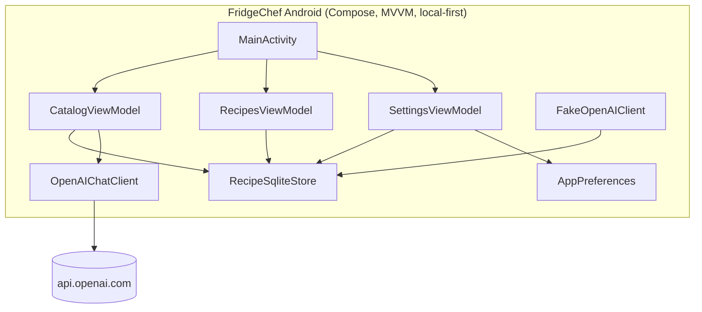
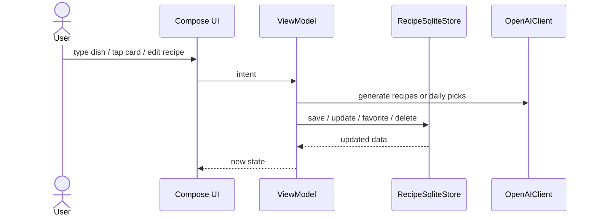

# FridgeChef Android

> Type a dish, pick a meal idea, snap your fridge, or save your own recipe.

Android port of FridgeChef — recipe catalog home screen, personal cookbook with full CRUD, redesigned list rows, date grouping, and 69 tests across five layers. Follows the cross-platform contract in `recipe-ingredients-ios/docs/CROSS_PLATFORM_SPEC.md`. Local-first: no account, no backend, no cloud sync.

<p align="center">
  
  &nbsp;
  
  &nbsp;
  
</p>

<p align="center"><sub>Catalog, cookbook, and settings in one local-first Android app.</sub></p>

---

## Features

- Recipe Catalog Home with four entry points
  - text field for any dish name
  - Breakfast / Lunch / Dinner idea cards
  - From my fridge photo flow
  - magic surprise button
  - Return/Go key submits the dish field
- Daily meal-card picks cached once per calendar day; silently refreshed when stale
- Recipes list redesigned to match iOS spec
  - Fraunces bold title, accent strip (terracotta = AI, sage = user)
  - FlowRow ingredient chips
  - Interactive heart button per row (one tap to favorite/unfavorite)
  - Batches grouped by date (Today / Yesterday / This Week / month)
  - Empty-state illustration when no recipes saved
- Personal cookbook: full CRUD
  - create a custom recipe
  - edit any recipe (AI-generated or user-created)
  - favorite recipes with optimistic toggle + revert on error
  - filter All / Favorites
  - delete a single recipe or an entire batch
  - delete from the edit form
- `RecipeFormValidator` pure function for save-button enablement (testable without Compose)
- Local SQLite with foreign-key constraints; portable schema from iOS spec
- `Preferences` interface extracted for VM testability; `SharedPreferences` implementation
- Real OpenAI client for production; fake client for deterministic builds and UI tests

## Walkthrough

### Recipe Catalog Home

| Catalog | Create Recipe |
|---|---|
|  |  |

The home tab combines a dish input, the four recipe entry points, and a surprise button. Cookbook Phase 1 adds the manual recipe form from the Recipes tab.

### Recipes and Settings

| Recipes | Settings |
|---|---|
|  |  |

Recipes behave like a personal cookbook: date-grouped batches, per-row heart toggle, create/edit/delete flows, and an All / Favorites filter. Settings exposes theme switching and API-key status.

---

## Architecture



### Data flow



### Key principles

- UI is Compose-only, with one activity and state-driven screens.
- ViewModels own the business logic and call services through interfaces.
- Persistence is local SQLite plus SharedPreferences.
- Real app builds use the OpenAI client; UI tests use a fake client for deterministic runs.
- The app keeps the same offline cookbook behavior even when the API key is absent.

## Tech Stack

| Layer | Choice |
|---|---|
| UI | Jetpack Compose |
| Architecture | MVVM + `StateFlow` |
| Concurrency | Kotlin coroutines |
| Networking | Direct OpenAI Chat Completions |
| Persistence | SQLiteOpenHelper + SharedPreferences |
| Min Android | API 28 |
| Tests | JUnit 4 + Robolectric + MockWebServer + Compose UI tests |
| Project layout | Single app module |

## Project Structure

```
recipe-ingredients-android/
├── app/
│   └── src/
│       ├── main/java/com/zeekrbaha/fridgechef/
│       │   ├── MainActivity.kt          # all Compose screens + navigation
│       │   ├── RecipeFormValidator.kt   # pure isSaveable function
│       │   ├── FridgeChefApplication.kt # dependency wiring
│       │   ├── data/
│       │   │   ├── Models.kt            # Recipe, RecipeBatch, DailyPicks, enums
│       │   │   ├── RecipeStore.kt       # interface + RecipeStoreNotFoundException
│       │   │   ├── RecipeSqliteStore.kt # SQLiteOpenHelper implementation
│       │   │   └── AppPreferences.kt    # Preferences interface + SharedPrefs impl
│       │   ├── network/
│       │   │   ├── OpenAIClient.kt      # interface + OpenAIChatClient (endpoint injectable)
│       │   │   ├── FakeOpenAIClient.kt  # deterministic fake for tests/fake builds
│       │   │   ├── APIKeyProvider.kt    # interface + BuildConfig implementation
│       │   │   ├── OpenAIError.kt       # sealed error types
│       │   │   └── Prompts.kt           # system prompt strings
│       │   ├── viewmodel/
│       │   │   ├── AppViewModels.kt     # CatalogVM, RecipesVM, SettingsVM, factory
│       │   │   └── RecipeGrouping.kt    # pure groupBatches + applyFilter functions
│       │   └── ui/theme/Theme.kt        # Material3 theme, Fraunces font
│       ├── test/                        # 59 JVM unit tests (Robolectric + MockWebServer + fakes)
│       └── androidTest/                 # 10 instrumented tests (CookbookFlowTest)
├── docs/screenshots/
└── gradlew
```

## Setup

Create `local.properties` in the repo root. This file is ignored by git:

```properties
OPENAI_API_KEY=<your-openai-api-key>
```

Build the debug app:

```bash
./gradlew :app:assembleDebug
```

## Tests

**69 tests total** across two runners (59 JVM unit + 10 instrumented).

| Suite | Count | Runner | What it covers |
|---|---|---|---|
| `RecipeSqliteStoreTest` | 11 | Robolectric (JVM) | Full store contract: save, load, order, setFavorite, update, deleteRecipe/Batch, cascade |
| `OpenAIChatClientTest` | 14 | MockWebServer (JVM) | Request shape, model, auth header, response_format, decode, 401/4xx/5xx/Decoding errors |
| `CatalogViewModelTest` | 10 | JVM fakes | 6 generate paths (dish/meal/image/surprise/blank/error) + 4 daily-picks lifecycle states |
| `RecipesViewModelTest` | 6 | JVM fakes | create, update, favorite toggle (optimistic + revert), delete cascade |
| `RecipeFormValidatorTest` | 6 | JVM pure | `isSaveable` — blank title, whitespace title, missing ingredients/steps, valid form |
| `SettingsViewModelTest` | 4 | JVM fakes | clearRecipes success/error, setTheme, hasApiKey |
| `RecipeGroupingTest` | 3 | JVM pure | Date bucket logic (Today / Yesterday / This Week / month) |
| `RecipeFilterTest` | 2 | JVM pure | All vs Favorites filter |
| `AppPreferencesLogicTest` | 1 | JVM | Daily-picks staleness check |
| `PromptContractTest` | 2 | JVM pure | System prompt string contracts |
| `CookbookFlowTest` | 10 | Instrumented | End-to-end flows on real emulator |

Run JVM tests:

```bash
./gradlew testDebugUnitTest
```

Run connected emulator UI tests (`-PUITEST_FAKE_OPENAI=true` swaps in deterministic responses):

```bash
./gradlew -PUITEST_FAKE_OPENAI=true connectedDebugAndroidTest
```

Current verified status: all 59 JVM tests pass; `CookbookFlowTest` 10/10 on `Pixel_8_API_36`.

## GitHub

- Android repo: https://github.com/ZeekrBaha/fridgechef-android
- iOS reference repo: https://github.com/ZeekrBaha/fridgechef-ios
