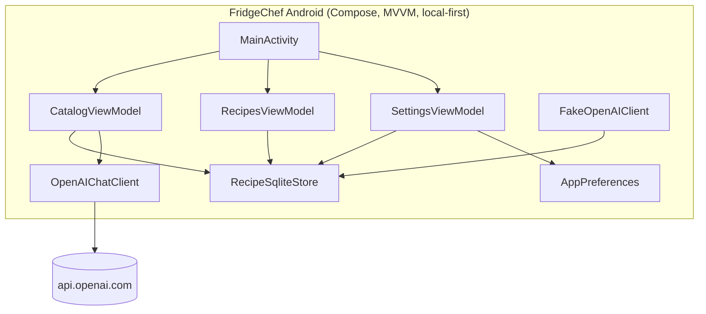
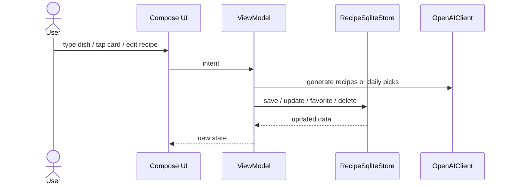

# FridgeChef Android

> Type a dish, pick a meal idea, snap your fridge, or save your own recipe.

Android port of FridgeChef with a recipe catalog home screen, local cookbook storage, and cookbook phase 1 features for creating, editing, favoriting, filtering, and deleting recipes. The app follows the cross-platform contract in `recipe-ingredients-ios/docs/CROSS_PLATFORM_SPEC.md` and keeps the same local-first model: no account, no backend, no cloud sync.

<p align="center">
  
  &nbsp;
  
  &nbsp;
  
</p>

<p align="center"><sub>Catalog, cookbook, and settings in one local-first Android app.</sub></p>

---

## Features

- Recipe Catalog Home with four entry points
  - text field for any dish name
  - Breakfast / Lunch / Dinner idea cards
  - From my fridge photo flow
  - magic surprise button
- Daily meal-card picks cached once per calendar day
- Cookbook Phase 1 recipe management
  - create a custom recipe
  - edit generated or user-created recipes
  - favorite recipes
  - filter favorites in Recipes
  - delete a single recipe
  - delete a full batch
- Local SQLite persistence using the portable schema from the iOS spec
- SharedPreferences for theme and daily-pick cache
- Real OpenAI chat completions flow for app builds, with a fake client available for deterministic UI tests

## Walkthrough

### Recipe Catalog Home

| Catalog | Create Recipe |
|---|---|
|  |  |

The home tab combines a dish input, the four recipe entry points, and a surprise button. Cookbook Phase 1 adds the manual recipe form from the Recipes tab.

### Recipes and Settings

| Recipes | Settings |
|---|---|
|  |  |

Recipes now behave like a personal cookbook: saved batches, create flow, edit flow, favorite toggle, favorites filter, and deletes. Settings keeps theme switching and key status visible.

---

## Architecture



### Data flow



### Key principles

- UI is Compose-only, with one activity and state-driven screens.
- ViewModels own the business logic and call services through interfaces.
- Persistence is local SQLite plus SharedPreferences.
- Real app builds use the OpenAI client; UI tests use a fake client for deterministic runs.
- The app keeps the same offline cookbook behavior even when the API key is absent.

## Tech Stack

| Layer | Choice |
|---|---|
| UI | Jetpack Compose |
| Architecture | MVVM + `StateFlow` |
| Concurrency | Kotlin coroutines |
| Networking | Direct OpenAI Chat Completions |
| Persistence | SQLiteOpenHelper + SharedPreferences |
| Min Android | API 28 |
| Tests | JUnit + Compose UI tests |
| Project layout | Single app module |

## Project Structure

```
recipe-ingredients-android/
├── README.md
├── build.gradle.kts
├── settings.gradle.kts
├── gradle.properties
├── gradle/
├── app/
│   ├── build.gradle.kts
│   └── src/
│       ├── main/
│       │   ├── AndroidManifest.xml
│       │   ├── java/com/zeekrbaha/fridgechef/
│       │   ├── res/
│       │   └── ...
│       └── androidTest/
├── docs/
│   └── screenshots/
└── gradlew
```

## Setup

Create `local.properties` in the repo root. This file is ignored by git:

```properties
OPENAI_API_KEY=<your-openai-api-key>
```

Build the debug app:

```bash
./gradlew :app:assembleDebug
```

## Tests

Run JVM tests and build the app:

```bash
GRADLE_USER_HOME=/private/tmp/gradlehome ./gradlew testDebugUnitTest assembleDebug assembleDebugAndroidTest
```

Run connected emulator UI tests:

```bash
GRADLE_USER_HOME=/private/tmp/gradlehome ./gradlew -PUITEST_FAKE_OPENAI=true connectedDebugAndroidTest
```

`UITEST_FAKE_OPENAI=true` swaps in deterministic recipe and daily-pick responses for instrumented UI runs. Normal app builds still use the real OpenAI client.

Current verified status:

- `testDebugUnitTest assembleDebug assembleDebugAndroidTest`: passing
- `connectedDebugAndroidTest`: 8 tests passing on `Pixel_8_API_36`

## GitHub

- Android repo: https://github.com/ZeekrBaha/recipe-ingredients-android
- iOS reference repo: https://github.com/ZeekrBaha/fridgechef-ios
